# Boissipay

## Context

Le SI d’une agence de voyages est composé de nombreux Microservices.

### **Éléments fonctionnels**

Le responsable du SI souhaite mettre en œuvre un système de paiement différé pour ses clients grands compte (ex : le
comité d’entreprise d’une très grande entreprise qui pré-réserve des voyages pour ses collaborateurs).

Le principe est que ces clients, après souscription à un contrat de paiement différé, pourront payer leurs achats de
voyages en fin du mois.

### **Éléments techniques**

Ce service de paiement différé sera supporté principalement par deux Microservices : le Microservice de facturation et
le Microservice de gestion de contrat.

### 1. Service de facturation

Le service de facturation accumule des opérations (principalement des achats) et génère à la fin du mois une facture.

Le Microservice de facturation a les fonctions suivantes :

- Acception des opérations (achat ou remboursement)
- Run de facturation : génération d’une facture à la fin du mois pour chacun des clients

**Règles de gestion :**

- Un achat est accepté selon les conditions suivantes
    - Le contrat est toujours valide
    - Le mandat de prélèvement est toujours valide
    - Le seuil de l’encours n’est pas dépassé

### 2. Service de contrat

Le service de contrat gère la mastérisation d’un contrat pour son client.

**Règles de gestion :**

- Diffusion des souscriptions au service de facturation
- Diffusion des changements (suspension/annulation des contrats)

### En entrée

- API Swagger Service Facturation
- API Swagger Service de gestion de contrat

### Objectif

Décrire et illustrer l’interaction entre ces deux microservices en prenant en compte les problématiques d’usage

### Recommandations

1. Ne pas utiliser tous les endpoints REST existant
2. Votre design doit limiter les interactions (ex: le système de facturation doit contenir tous les éléments pour savoir
   si le contrat est actif)
3. Ne pas oublier de publier

### Contraintes

1. Conserver une approche contract-first pour les API REST
    - Possibilité de rajouter /modifier les API données en entrée
2. Utiliser Apache Kafka
    - Un seul broker est suffisant
    - Une seule partition pour chacun des topics est suffisant

### Livrables

- Présentation :
    - Spécifier en détail les usages API ou Event
    - Identifier les choix CQRS
- Code/Démo
    - Se restreindre sur les contrats d’interface, les mécanismes d’interaction
        - Le développement de la logique métier n’est pas attendu
        - Pas de base de données est attendu

## Spécifications

### Architecture du SI

Voici le schéma de l’architecture du SI de Boissipay :

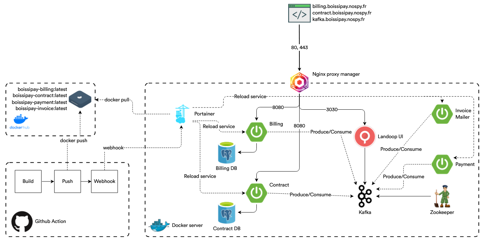

### CI/CD

La CI/CD est géré par :

- **GitHub Action** : Construit l'image docker de tous nos composants, l'envoie sur le dépôt, puis envoie un signal au
  serveur hébergeant l'application.
- **Docker Hub** : Contient les images docker de tous nos composants.
- **Portainer** : Permet de visualiser l'état des conteneurs. C'est également lui qui contient le manifest du Docker
  Compose permettant à l'application de se déployer. C'est également lui qui reçoit le signal provenant de GitHub Action
  afin de mettre à jour les services.

### Services

Boissipay est composé de 5 services principaux :

- **Service de facturation** : Permet de gérer les achats et les remboursements.
- **Service de contrat** : Permet de gérer les contrats.
- **Service de paiement** : Permet de gérer les paiements.
- **Service d'envoi de mail** : Permet d'envoyer des mails de facturation aux clients.
- **Kafka** : Permet de gérer les événements entre les différents services.

D'autres services sont utilisés pour avoir une application robuste :

- **Base de données des paiements** : Permet de stocker les paiements et leur status.
- **Base de données des contrats** : Permet de stocker les contrats et leur status.
- **Landoop UI** : Permet de visualiser l'état du service Kafka
- **Zookeeper** : Apporte de la persistence au niveau de Kafka.
- **Nginx Proxy Manager** : Permet de gérer le routage vers nos services.

### Génération de code (API Delegate)

Afin de rester conforme à la spécification, nous avons mis en place une génération automatique de code pour les API
REST. Cela se fait grâce à un module java dédié `Specification` aussi bien pour **Contract** que **Billing** et va
générer la partie API de notre application Spring.

| Dossier                             | Pom.xml                             |
|-------------------------------------|-------------------------------------|
| 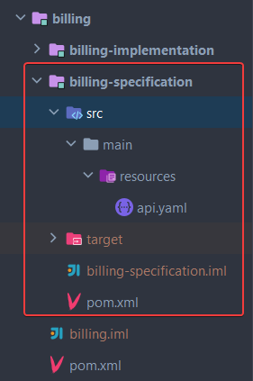 | 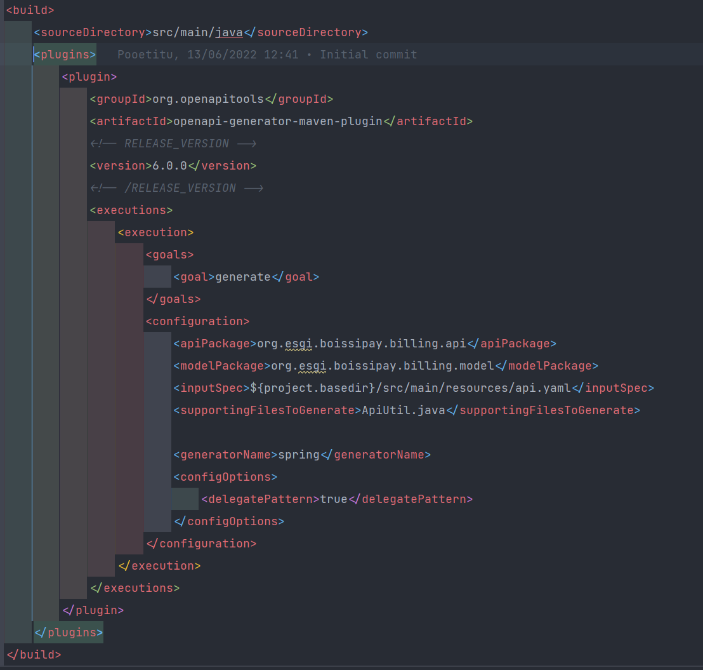 |

Tout le code métier sera dans le module `Implementation` et viendra surcharger l'API de base généré depuis le Swagger.

```java

@Component
public class SpringOperationsApiDelegate implements OperationsApiDelegate {

    // ...

    @Override
    public ResponseEntity<OperationResponse> operationsPost(OperationRequest operationRequest) {
        String operationId = newOperationUseCase.newOperation(OperationMapper.toOperation(operationRequest));
        var operation = getOperationUseCase.getOperation(operationId);
        return ResponseEntity.ok(OperationMapper.toOperationResponse(operation));
    }

    // ...
}
```

### Docker

Nous avons en place des `Dockerfile` pour chaque composant.
Ces derniers prendront en charge certaines variables d'environnement afin de configurer l'application Spring au
lancement (Ex : Les identifiants de base de données).

```Dockerfile
FROM maven:3.8.5-eclipse-temurin-17-alpine as build
WORKDIR /app
COPY pom.xml .
COPY . .

RUN mvn clean install -DskipTests

FROM openjdk:17-alpine
WORKDIR /app
COPY --from=build /app/contract/contract-implementation/target/*.jar /app/boissipay-contract.jar

EXPOSE 8080

ENV KAFKA_HOST=localhost\
    KAFKA_PORT=9092\
    KAFKA_GROUP_ID=boissipay\
    KAFKA_AUTO_OFFSET_RESET=earliest\
    KAFKA_TOPIC_CREATE_CONTRACT=create-contract\
    DATASOURCE_CONNECTION_TIMEOUT=20000\
    DATASOURCE_MAXIMUM_POOL_SIZE=5\
    H2_CONSOLE_ENABLED=true\
    JPA_OPEN_IN_VIEW=false\
    JPA_GENERATE_DDL=true\
    DATABASE_HOST=localhost\
    DATABASE_PORT=5432\
    DATABASE_NAME=contract\
    DATABASE_USER=contract\
    DATABASE_PASSWORD=contract\
    JPA_HIBERNATE_DDL_AUTO=update

CMD ["java", "-jar","-Dspring.profiles.active=env", "/app/boissipay-contract.jar"]
```

Un fichier [docker-compose.yml](./docker-compose.yml) est utilisé pour déployer l'application dans son entièreté sans se
prendre la tête.

Des tests de vie et une ordnance de lancement est mis en place pour que chaque service ne démarre que si les prérequis
sont remplis.

```yaml
version: '3.8'

services:
  kafka:
    image: landoop/fast-data-dev:latest
    environment:
      ...
    restart: unless-stopped
    networks:
      - boissipay-network
    ports:
      # - 2181:2181               # Zookeeper
      - '3030:3030'               # Landoop UI
      # - 8081-8083:8081-8083     # REST Proxy, Schema Registry, Kafka Connect ports
      # - 9581-9585:9581-9585     # JMX Ports
      # - '9092:9092'
    volumes:
      - 'kafka_data:/data'
    healthcheck:
      test: nc -z localhost 2181 || exit -1
      interval: 10s
      timeout: 10s
      retries: 10

  contract_db:
    image: bitnami/postgresql:14
    environment:
      POSTGRESQL_USERNAME: ${CONTRACT_DB_USERNAME}
      POSTGRESQL_PASSWORD: ${CONTRACT_DB_PASSWORD}
      POSTGRESQL_DATABASE: ${CONTRACT_DB_NAME}
    volumes:
      - contract_db_data:/bitnami/postgresql
    restart: unless-stopped
    networks:
      - boissipay-network
    ports:
      - '5433:5432'
    healthcheck:
      test: [ "CMD", "pg_isready", "-U", "contract", "-d", "contract" ]
      interval: 20s
      timeout: 10s
      retries: 5

  contract:
    depends_on:
      contract_db:
        condition: service_healthy
      kafka:
        condition: service_healthy
    build:
      context: .
      dockerfile: Dockerfile.contract
    environment:
      KAFKA_HOST: kafka
      KAFKA_PORT: 9092
      KAFKA_GROUP_ID: ${KAFKA_GROUP_ID}
      DATABASE_HOST: contract_db
      DATABASE_PORT: 5432
      DATABASE_NAME: ${CONTRACT_DB_NAME}
      ...
    restart: unless-stopped
    networks:
      - boissipay-network
    ports:
      - '8080:8080'

  billing_db:
    ...

  billing:
    ...
    restart: unless-stopped
    networks:
      - boissipay-network
    ports:
      - '8181:8080'

  payment:
    ...

  invoice:
    ...

volumes:
  kafka_data:
  contract_db_data:
  billing_db_data:

networks:
  boissipay-network:
    driver: bridge
```

### Contract

**Contract** est un composant qui va gérer les opérations de création de contrat.

- Lors de la création d'un contrat, ce dernier est enregistré en base de donnée.
- Une fois cela fait, un message est envoyé sur le topic `create-contract` pour que le contrat soit créé sur le Kafka.
- Ce dernier sera consommé plus tard par le module **Billing**.

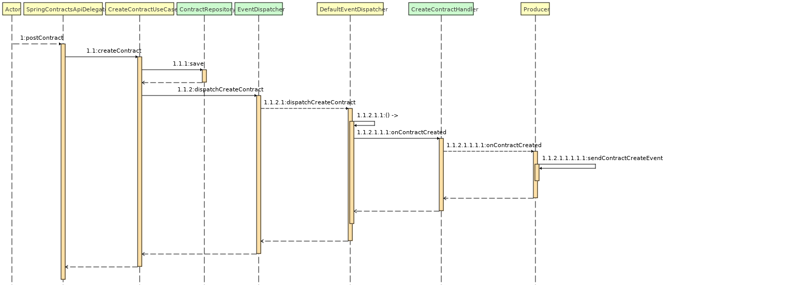

### Billing

**Billing** est un composant qui va gérer les opérations de souscription et de paiements sur un contrat.

#### Contract Created

**Billing** consomme les messages kafka concernant une création de contrat. Lorsqu'il en reçoit un, il va enregistrer en
base le contrat créé ainsi que quelques-unes de ses informations nécessaires (Ex: durée de validité).

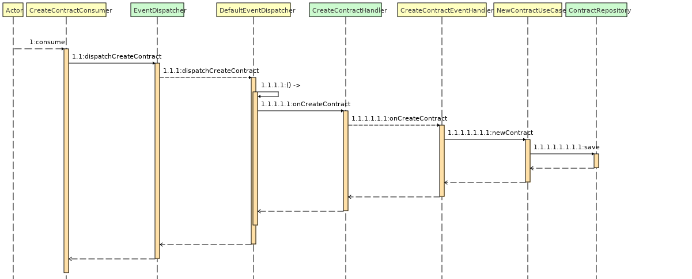

#### New operation

Un utilisateur peut ajouter une nouvelle opération sur un contrat actif. Une opération peut contenir des _Order_ qui eux
même contiennent des _Items_, ces derniers étant des achats avec un coût.

L'ajout d'une opération va entrainer un enregistrement en base de ce dernier, ainsi que la création d'un paiement (à ce
stade non effectué) avec l'envoie d'un message kafka à destination du service de paiement.

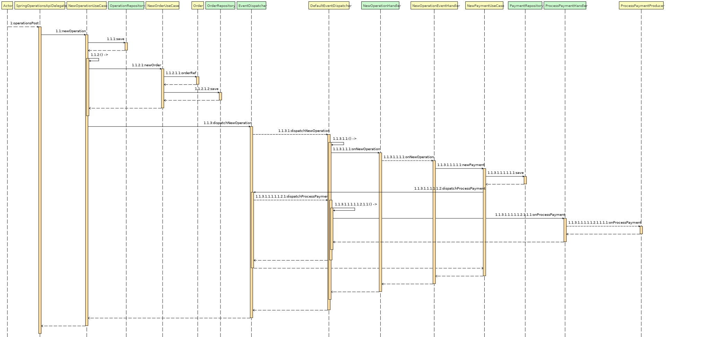

#### Payment accepted

Lorsqu'un paiement est accepté par le service de paiement, le service **Billing** consomme le message kafka et va mettre
à jour le status du paiement afin de le valider.

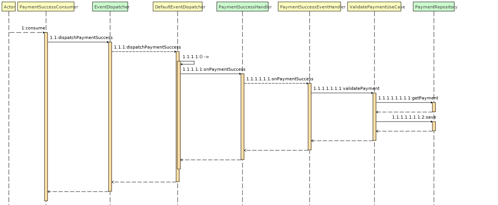

#### Invoice scheduling

Tous les mois, une facture est envoyée à chaque utilisateur ayant fait des opérations sur un contrat.
Le service **Billing** génère la facture en fonction des opérations effectuées sur le contrat. Cette dernière est
ensuite envoyée à Kafka pour que le service de facturation puisse la traiter.

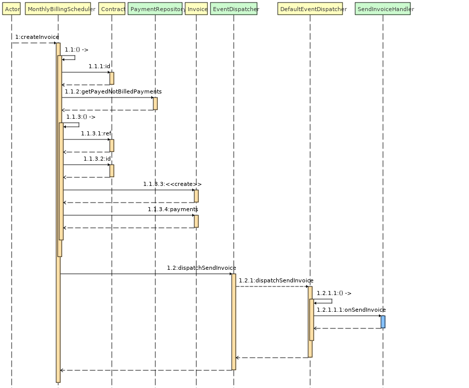

#### Invoice Sent

**Billing** possède un `Consumer` Kafka dans le cas où la facture a bien été envoyé au client.
Lorsque c'est le cas, on met à jour le status des paiements concerné pour les passer en _Facturé_.

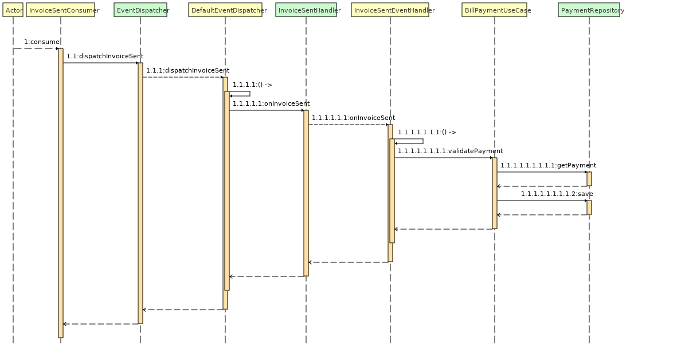

### Payment

**Payment** est un composant qui va gérer les opérations de paiement.<br/>
Ce dernier va écouter le topic `payment` et lorsqu'il reçoit un message, il va effectuer le paiement. Le paiement est
actuellement simulé et le service va directement envoyé un message Kafka de succès.

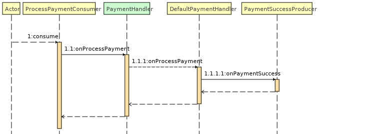

### Invoice Mailer

**Invoice Mailer** est un composant qui va gérer l'envoie de facture à l'utilisateur.<br/>
Ce dernier va écouter le topic `invoice` et lorsqu'il reçoit un message, il va envoyer la facture à l'utilisateur.
Pour le moment aucun mail n'est vraiment envoyé, cela est juste simulé. On renvoie directement un message à Kafka de
confirmation.

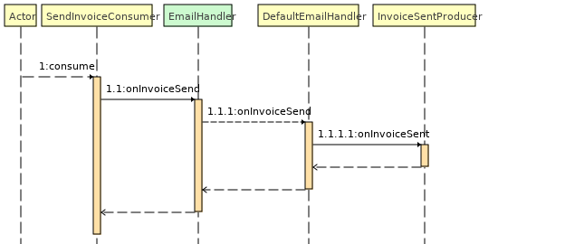